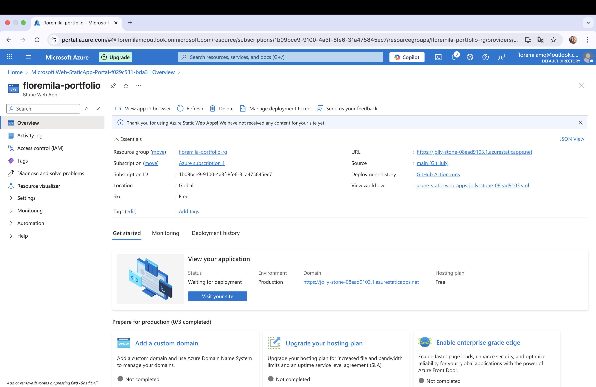
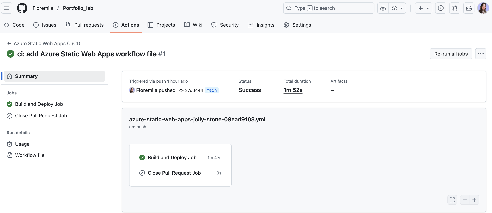
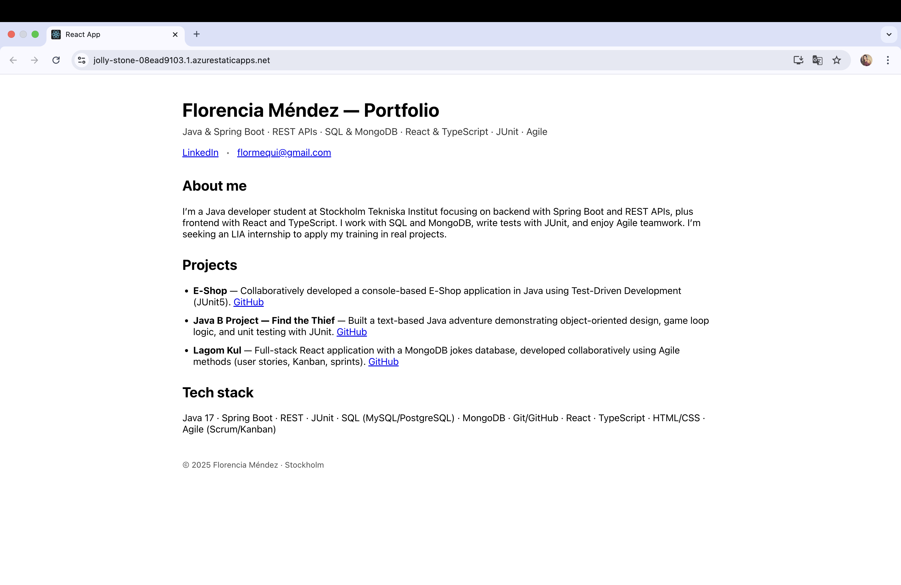

# Florencia's Portfolio – Azure Static Web App

**Live URL:** [Portfolio online](https://jolly-stone-08ead9103.1.azurestaticapps.net/)  
**Repo:** [GitHub – Portfolio_lab](https://github.com/Floremila/Portfolio_lab)

---

## What is Azure?  
Azure is Microsoft’s cloud computing platform. It provides a very large ecosystem of services that can be used to build, deploy, and manage applications and infrastructure. Instead of having to buy and maintain your own physical servers, you can use Azure to access resources such as virtual machines, databases, storage, networking, and even advanced services like machine learning or serverless functions. Everything is managed through the Azure portal, the command line, or APIs, which makes it flexible for both developers and organizations. For this lab project, Azure offered me a quick and reliable way to publish my portfolio without needing to worry about hardware or complicated infrastructure.  

---

## What is the cloud?  
The cloud in general refers to the delivery of IT resources via the internet. This means that instead of running software or storing data only on your own computer or on local servers, you access computing power, storage, and services provided by large data centers around the world. For the end user, this provides clear advantages: you can access your services from anywhere, you do not need to handle hardware failures, and you usually only pay for what you actually use. In practice, the cloud shifts responsibility: instead of maintaining physical infrastructure yourself, the cloud provider (in this case Microsoft) takes care of availability, redundancy, and scaling.  

---

## Scaling and pricing in Azure  
One of the most important features of cloud services is scalability. In Azure this can be done in two main ways:  
- **Vertical scaling:** giving more power (CPU, memory) to a single instance. This is similar to upgrading a computer with better hardware.  
- **Horizontal scaling:** running multiple instances of the same application in parallel so that incoming traffic is distributed. This is often the most effective way to handle sudden increases in demand.  

Regarding pricing, Azure uses an **OpEx (operational expenditure)** model rather than a **CapEx (capital expenditure)** model. In practical terms, this means I do not buy hardware upfront. Instead, I consume resources and pay based on actual usage, such as storage used, compute time, or number of requests. This flexibility is especially relevant for students and smaller projects, because I can start with the free tier and scale up only if my application grows.  

---

## How I deployed my portfolio  
For this lab, I created a simple portfolio web application using **React**. The application contains a short introduction about myself, a list of projects with links to my GitHub repositories, and a description of the technologies I use. Once the project was built locally, I uploaded the code to GitHub.  

In the Azure portal, I then created a **Static Web App** resource. During the setup I connected my GitHub repository and specified the correct folder where my React project is located (`floremila-portfolio`) and the output directory (`build`). Azure automatically generated a **GitHub Actions workflow**. This workflow runs every time I push changes to the main branch: it installs the dependencies, builds the React app, and deploys the output to the Azure servers.  

After the workflow completed successfully, the portfolio was available on a public URL provided by Azure Static Web Apps. To verify, I visited the link in my browser and confirmed that my site was live. I also documented this process with screenshots from the Azure portal (overview page), from GitHub Actions (successful run), and from the live site itself.  

---

## Evidence (screenshots)

  

---

